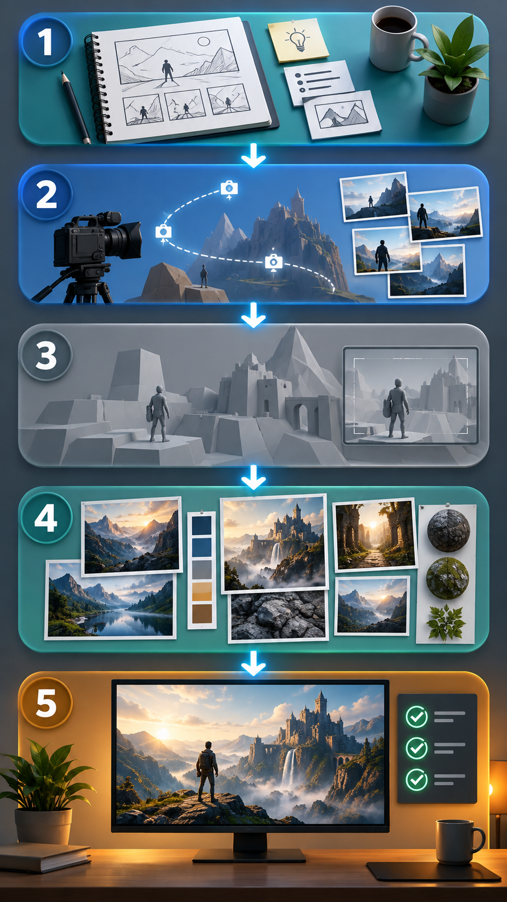

# 影视预演流水线 Skill


`previs-to-seedance` v2.12 是一套面向 Codex 的影视预演工作流：先把故事、运镜、空间和动作因果做成可检查的 Blender 几何预演，再用目标风格参考约束最终画面，最后在明确授权后通过已配置并有权限使用的 Seedance 2.5 入口生成成片。

> 核心原则：预演决定镜头与动作，风格参考决定最终外观。技术通过、视觉通过和用户接受必须分别记录。

## 流程总览



1. 编剧与导演：锁定故事、动作因果、画幅、时长和镜头规则。
2. 运镜参考：实际查看 Higgsfield 参考片段，提炼可观察的构图、路径、视差和节奏标准。
3. Blender 预演：用低模 Blockout / Playblast 验证空间、接触、动作与相机，不承担最终风格渲染。
4. 风格参考：审核角色、场景、道具和关键状态图，逐项绑定素材职责。
5. Seedance 成片：审核提示词与提交参数；只有获得授权后才通过 Seedance 2.5 入口生成，并做运镜、动作、风格和技术联合验收。

两张图片均为 AI 教学示意图，不是软件运行截图或成片验收证据。

## 重要边界

- Higgsfield 只用于运镜参考和验收标准，不使用其生图或生视频能力。
- Blender 只做简单网格、平涂材质的几何预演；默认 9:16、24 fps、无音轨。
- 最终视频只使用已配置并有权限使用的 Seedance 2.5 入口；不得擅自更换模型、未核实接口或其他平台。
- 图片审核、预演通过和修改 Skill 都不等于已授权付费生成。
- 失败、失踪或视觉不合格的生成任务不会自动重试。

## 安装

### 方法一：复制 Skill 目录

```powershell
git clone https://github.com/bjdenghao-cn/previs-to-seedance.git
$destination = Join-Path $env:USERPROFILE '.codex\skills\previs-to-seedance'
Copy-Item -Recurse -Force '.\previs-to-seedance\previs-to-seedance' $destination
```

重启 Codex 后，使用 `$previs-to-seedance` 调用。

### 方法二：只下载 ZIP

从仓库根目录下载 `previs-to-seedance-v2.12.zip`，解压后确保目录结构为：

```text
~/.codex/skills/previs-to-seedance/
├── SKILL.md
├── agents/openai.yaml
└── references/
```

## 最小使用方式

在 Codex 中直接描述需求即可，例如：

```text
使用 $previs-to-seedance，为一个 12 秒、9:16 的悬疑短片制作影视预演。
先交付导演脚本、Higgsfield 运镜参考标准和 storyboard.json，
不要生成图片或视频，等我确认后再进入 Blender 预演。
```

继续到预演阶段：

```text
沿用已确认脚本，制作 24 fps、无音轨的 Blender Playblast。
完整检查穿模、接触、步速、动作因果和 Higgsfield 运镜对照，
先给我审核预演，不提交付费生成。
```

提交最终生成前：

```text
使用已批准的预演和风格参考，按 Seedance 2.5 规则整理提示词与素材清单。
先列出模型、数量、时长、比例、声音和素材顺序，等我授权后再通过 Seedance 2.5 入口提交。
```

完整阶段说明、交付物和验收表见 [使用说明](docs/USAGE.md)。示例结构见 [storyboard.example.json](examples/storyboard.example.json)。

## 依赖与环境

按执行阶段准备对应能力；缺失时应明确报告，不能假称已经调用：

- Codex Skills：`screenplay-expert`、`seedance-25-rules`、`imagegen`
- Blender 与可用的 Blender MCP 连接
- 可实际查看的 Higgsfield 运镜参考素材
- 已配置并有权限使用的 Seedance 2.5 入口
- FFmpeg / ffprobe，用于视频技术检查

## 仓库内容

```text
previs-to-seedance/
├── README.md
├── docs/
│   ├── USAGE.md
│   └── images/
├── examples/
│   └── storyboard.example.json
├── previs-to-seedance/
│   ├── SKILL.md
│   ├── agents/openai.yaml
│   └── references/battlefield-immersion.md
└── previs-to-seedance-v2.12.zip
```

## 版本

- 当前版本：v2.12
- 可见名称：影视预演流水线 Skill
- 调用名称：`$previs-to-seedance`
